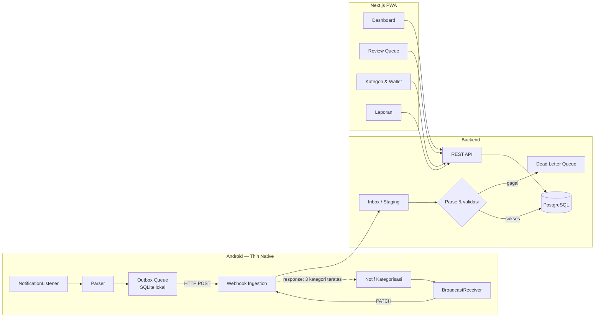

# PRD v2 — Pencatatan Keuangan Otomatis (Thin-Native + Web)

**Versi:** 2.0 — menggantikan v1 (full-native, offline-only)
**Platform:** Android (capture) + Web/PWA (semua UI lain)
**Status:** Draft untuk MVP

---

## 1. Ringkasan Perubahan dari v1

| Aspek | v1 | v2 |
|---|---|---|
| Arsitektur | Full native, offline-only | Thin native capture + backend + web UI |
| Kotlin | Seluruh aplikasi | ~500 baris, satu modul |
| UI | Compose | Next.js PWA |
| Database | Room di device | PostgreSQL di server |
| Sync | Tidak ada | Inheren (server jadi source of truth) |
| Web | Tidak ada | First-class |

**Alasan perubahan:** kebutuhan web masuk ke scope, dan pengalaman Kotlin belum ada. Thin-native memindahkan 90% pekerjaan ke stack yang sudah dikuasai tanpa mengorbankan fitur inti — capture otomatis dan prompt satu tap tetap native karena memang hanya bisa di sana.

---

## 2. Problem Statement

Aplikasi pencatatan keuangan mengharuskan input manual: transaksi terjadi → buka app bank → cek riwayat → ketik ulang. Friksi ini bikin orang berhenti mencatat dalam hitungan minggu.

Datanya sebenarnya sudah ada. myBCA mengirim notifikasi berisi nominal setiap transaksi, lalu data itu lewat dan hilang.

**Hipotesis:** kalau pencatatan terjadi otomatis dan kategorisasi cukup satu tap dari notifikasi, konsistensi pencatatan naik drastis.

---

## 3. Arsitektur



### Pembagian tanggung jawab

**Android (thin) — hanya yang mustahil di web:**
- Menangkap notifikasi m-banking
- Parsing dasar
- Outbox lokal supaya tidak hilang saat offline
- Menampilkan notifikasi kategorisasi dengan action button

**Backend — otak sistem:**
- Ingestion, validasi, dedupe, DLQ
- Model data lengkap
- Mesin saran kategori
- REST API

**Web PWA — semua interaksi manusia:**
- Dashboard, review, CRUD, laporan, pengaturan

**Prinsip pembatas:** apapun yang bisa dikerjakan di web, tidak boleh masuk ke Android.

---

## 4. Tech Stack

| Layer | Pilihan | Alasan |
|---|---|---|
| Android | Kotlin + WorkManager + SQLite mentah | Tanpa Compose, tanpa Room, tanpa DI. Sekecil mungkin |
| Backend | Next.js API Routes + TypeScript | Satu codebase dengan frontend, stack yang sudah dikuasai |
| ORM | Drizzle | Type-safe, migrasi eksplisit, ringan |
| Database | PostgreSQL (Supabase/Neon) | Pooled connection wajib untuk serverless |
| Frontend | Next.js + Tailwind + PWA manifest | Sesuai stack harian |
| Auth | Google OAuth, session cookie HTTP-only | Standar, tidak perlu kelola password |
| Auth device | Token webhook terpisah (`Bearer wh_...`) | Android tidak memakai session user |
| Deploy | Vercel | Gratis untuk skala pribadi |

**Catatan:** jika berkolaborasi dengan backend Go yang sudah ada, Android dan kontrak API di dokumen ini tetap berlaku tanpa perubahan — yang berganti hanya implementasi server.

---

## 5. Model Data

Berbasis ERD v1 dengan penyesuaian:

**Perubahan dari v1:**
- `ACCOUNT.balance_cached` **dihapus.** Saldo dihitung lewat view dari `init_balance` + transaksi tercatat. Kolom cache berisiko desync.
- `deleted_at` ditambahkan ke seluruh tabel utama (soft delete) — wajib untuk sync.
- `RAW_NOTIFICATION` menjadi `INBOX_EVENT`, dengan `DEAD_LETTER` terpisah untuk yang gagal diproses berulang.
- Semua tabel utama mendapat `user_id` dan row-level security.
- `client_uuid` ditambahkan ke transaksi — dibuat di Android, dipakai untuk idempotency saat retry.

**Tabel:**

| Tabel | Peran |
|---|---|
| `users` | Akun, dari Google OAuth |
| `devices` | Perangkat Android terdaftar + token webhook |
| `accounts` | Wallet: myBCA, Cash, GoPay |
| `inbox_events` | Payload mentah dari device, apa adanya |
| `dead_letters` | Event yang gagal diproses, untuk investigasi & reparse |
| `transactions` | Inti |
| `categories` | Hierarkis, milik user |
| `merchants` | Dipelajari dari input user |
| `category_rules` | Mesin saran, `hit_count` untuk ranking |
| `recurring_rules` | Langganan & tagihan berulang |
| `tags`, `transaction_tags` | Reimburse, patungan |
| `budgets` | Pasca-MVP |

---

## 6. Kontrak API

Tiga endpoint ini yang dipakai Android. Sisanya untuk web.

### `POST /api/ingest`
Auth: `Authorization: Bearer wh_...`

```json
{
  "client_uuid": "uuid-v4-dibuat-di-device",
  "package_name": "com.bca.mybca.omni.android",
  "title": "Catatan Finansial",
  "body": "Pengeluaran sebesar IDR 10,000.00 di kategori Belanja.",
  "posted_at": 1755290965000
}
```

Response:
```json
{
  "transaction_id": "...",
  "amount": 10000,
  "direction": "debit",
  "suggested_categories": [
    { "id": "...", "name": "Jajan" },
    { "id": "...", "name": "Transport" },
    { "id": "...", "name": "Belanja" }
  ]
}
```

Idempoten berdasarkan `client_uuid`. Kirim ulang mengembalikan hasil yang sama, tidak membuat duplikat.

### `PATCH /api/transactions/:id`
Dipakai saat user menekan tombol kategori di notifikasi.
```json
{ "category_id": "...", "note": "Indomaret", "is_reviewed": true }
```

### `GET /api/health`
Dipakai Android untuk health check berkala.

---

## 7. Functional Requirements

### F1 — Android Capture
- **F1.1** Listener menangkap notifikasi dari package m-banking terdaftar
- **F1.2** Payload mentah masuk outbox SQLite lokal sebelum aksi apapun
- **F1.3** `client_uuid` dibuat di device untuk idempotency
- **F1.4** WorkManager mengirim outbox; retry dengan exponential backoff saat gagal
- **F1.5** Item terkirim ditandai, dihapus setelah 30 hari
- **F1.6** Service auto-restart setelah reboot

### F2 — Android Prompt
- **F2.1** Heads-up notification muncul setelah response ingest diterima
- **F2.2** Tiga action button dari `suggested_categories`
- **F2.3** Satu `RemoteInput` untuk mengetik merchant
- **F2.4** Tap tombol memanggil PATCH; jika offline, masuk outbox
- **F2.5** Tap body membuka PWA di halaman detail transaksi (deep link)
- **F2.6** Jika ingest gagal total, notif tetap muncul dengan pesan tertunda — user tahu ada yang belum masuk

### F3 — Ingestion Backend
- **F3.1** Payload disimpan ke `inbox_events` sebelum diproses
- **F3.2** Dedupe berdasarkan `client_uuid` dan hash konten
- **F3.3** Parser modular per bank, dengan `parser_version` tercatat
- **F3.4** Gagal parse setelah N retry masuk `dead_letters`, bukan hilang
- **F3.5** Reparse batch dapat dijalankan ulang atas `inbox_events` lama

### F4 — Mesin Saran Kategori
- **F4.1** Query `category_rules` berdasarkan nominal, waktu, dan merchant
- **F4.2** Urut berdasarkan `hit_count` lalu `priority`
- **F4.3** Setiap pemilihan menaikkan `hit_count`; rule baru dibuat otomatis jika belum ada
- **F4.4** Fallback ke tiga kategori tersering milik user

### F5 — Web PWA
- **F5.1** Dashboard: ringkasan bulan berjalan, breakdown kategori
- **F5.2** Antrian review transaksi belum dikategorikan, dengan aksi cepat
- **F5.3** CRUD transaksi manual untuk cash, gesek kartu, tarik tunai
- **F5.4** CRUD kategori, wallet, merchant, tag
- **F5.5** Daftar transaksi dengan filter periode, kategori, wallet
- **F5.6** Halaman status device: kapan terakhir kirim, jumlah pending
- **F5.7** Installable sebagai PWA, ikon di home screen

### F6 — Onboarding
- **F6.1** Login Google di web, buat device, salin token
- **F6.2** Android: paste token atau scan QR dari web
- **F6.3** Panduan grant notification access
- **F6.4** Panduan aktifkan Catatan Finansial di myBCA
- **F6.5** Panduan whitelist battery optimization per OEM
- **F6.6** Transaksi uji: user diminta melakukan transaksi kecil untuk verifikasi pipeline

### F7 — Health & Observability
- **F7.1** Android ping health tiap 6 jam
- **F7.2** Tidak ada ping > 24 jam → banner peringatan di web
- **F7.3** Outbox menumpuk > N item → notifikasi lokal ke user
- **F7.4** DLQ tidak kosong → indikator di halaman pengaturan

---

## 8. Non-Functional Requirements

- **Privasi:** payload notifikasi keluar device, maka wajib TLS, token per-device yang bisa dicabut, row-level security, dan privacy policy eksplisit. Token webhook tidak pernah punya akses baca data user lain.
- **Akurasi uang:** `bigint` satuan minor di seluruh sistem. Floating point dilarang, termasuk di JSON — kirim sebagai integer.
- **Ketahanan:** kehilangan transaksi tidak dapat diterima. Outbox lokal + idempotency + DLQ adalah tiga lapis pengaman.
- **Offline:** capture tetap jalan penuh tanpa koneksi. Yang tertunda hanya prompt kategori.
- **Latency:** ingest sampai notif muncul < 2 detik saat online.
- **Cold start:** serverless bisa lambat di request pertama. Endpoint ingest harus seringan mungkin; pekerjaan berat dipindah ke proses terpisah.

---

## 9. Development Workflow

### Fase 0 — Spike tanpa Kotlin (2–3 hari)
Buktikan pipeline sebelum menyentuh Android.

- Bikin endpoint `/api/ingest` dan skema database
- Gunakan **Tasker/MacroDroid** untuk menangkap notifikasi myBCA dan POST ke endpoint
- Pakai sendiri selama beberapa hari

**Exit criteria:** transaksi nyata masuk database tanpa satu baris Kotlin. Kumpulkan string notifikasi asli sebagai bahan uji parser.

**Nilai fase ini:** menghilangkan seluruh ketidakpastian produk lebih dulu, dan menghasilkan data uji nyata. Kalau konsepnya ternyata tidak berguna, kerugiannya tiga hari.

### Fase 1 — Backend inti (1 minggu)
- Skema Drizzle + migrasi
- Ingest dengan dedupe, idempotency, inbox, DLQ
- Parser myBCA + unit test dari data Fase 0
- Mesin saran kategori
- Auth Google + token device

**Exit criteria:** `go test`/`vitest` hijau, ingest idempoten terbukti, DLQ berfungsi.

### Fase 2 — Web PWA (1–1.5 minggu)
- Design token dari Claude Design ditetapkan lebih dulu
- Urutan: Dashboard → Review → Detail/Edit → Kategori & Wallet → Pengaturan
- Manifest + service worker

**Exit criteria:** seluruh alur bisa dijalankan dari browser, menggantikan penuh peran Tasker sebagai antarmuka.

### Fase 3 — Android thin native (3–5 hari)
Baru sekarang menyentuh Kotlin. Semua kontrak sudah pasti, tinggal implementasi.

Urutan:
1. Project kosong + satu layar status
2. `NotificationListenerService` → log ke Logcat saja
3. SQLite outbox
4. WorkManager + HTTP POST
5. Notification builder + action button
6. `BroadcastReceiver` → PATCH

Bikin **app dummy** penembak notifikasi berformat myBCA untuk pengujian berulang.

**Exit criteria:** notif dummy → tercatat di server → prompt muncul → tap kategori → terupdate, tanpa membuka app apapun.

### Fase 4 — Hardening (1 minggu)
- Onboarding lengkap
- Health check dua arah
- Uji di Xiaomi/Oppo dengan battery optimization aktif
- Uji reboot, uji offline berkepanjangan
- Uji token dicabut

**Exit criteria:** listener bertahan > 72 jam, tidak ada transaksi hilang selama pengujian.

### Fase 5 — Rilis (opsional)
- Privacy policy dipublikasikan
- Data Safety declaration + justifikasi notification access
- Distribusi via GitHub Releases atau Play Store

### Estimasi total
Solo dev: **4–5 minggu** sampai layak dipakai harian.

---

## 10. Risiko

| Risiko | Dampak | Mitigasi |
|---|---|---|
| BCA mengubah format notifikasi | Parser berhenti bekerja | `inbox_events` menyimpan payload utuh + `parser_version` → reparse tanpa kehilangan data |
| Listener dibunuh OEM | Transaksi hilang diam-diam | Health check dua arah + peringatan aktif |
| Cold start serverless | Ingest lambat, prompt telat | Outbox lokal membuat keterlambatan tidak berakibat kehilangan data |
| Token webhook bocor | Orang lain bisa menyuntik transaksi | Token per-device, dapat dicabut, scope hanya ingest |
| Play Store menolak notification access | Tidak bisa rilis publik | Justifikasi jelas + fallback GitHub Releases |
| Coverage tidak lengkap (kartu, ATM) | Laporan tidak akurat | Dikomunikasikan sejak onboarding; input manual dipermudah |
| Scope melebar ke "ERP" | MVP tidak selesai | Recurring, budget, sinking fund ditunda ke backlog |

---

## 11. Backlog Setelah MVP

- Parser bank lain (BRImo, Livin, Jago) — modular, satu file per bank
- Parsing email transaksi sebagai pelengkap
- Recurring rules & deteksi langganan
- Budget per kategori
- Reimbursement & sinking fund
- Export CSV
- Widget home screen Android
- Mode privasi penuh: opsi menjalankan backend sendiri

---

## 12. Keputusan yang Sudah Dikunci

Dicatat agar tidak dibahas ulang:

1. **Kategori BCA tidak dipakai** — disimpan sebagai arsip, kategorisasi tetap milik user
2. **Merchant manual** — notifikasi tidak memuatnya, dan itu diterima
3. **Tanpa LLM untuk kategorisasi** — rule-based dengan pembelajaran dari kebiasaan user sudah cukup
4. **Tanpa overlay popup** — heads-up notification, karena Android 10+ melarang launch Activity dari background
5. **Server jadi source of truth** — Android hanya punya outbox, bukan salinan penuh
6. **Uang selalu integer satuan minor** — tanpa pengecualian
